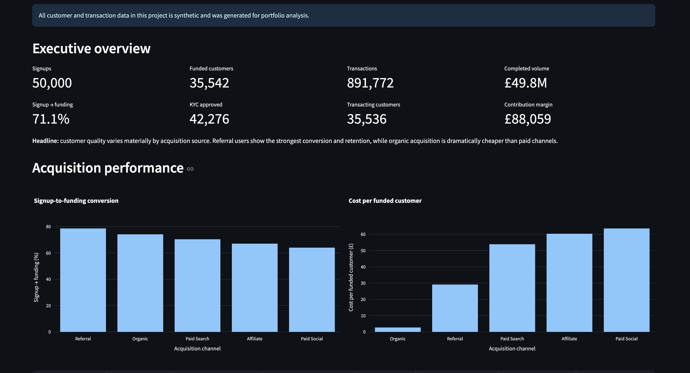

# Neobank Growth & Unit Economics Analytics

[](https://github.com/hajarmrifag/neobank-growth-analytics/actions/workflows/ci.yml)
[](https://github.com/hajarmrifag/neobank-growth-analytics/actions/workflows/banking-api.yml)
[](https://neobank-growth-analytics-hajar.streamlit.app/)


[](LICENSE)

End-to-end fintech product analytics on a fully synthetic neobank dataset. It models the customer journey from acquisition and KYC through account opening, funding, transactions, retention, experimentation and unit economics, using Python, PostgreSQL, SQL, statistical testing and an interactive Streamlit dashboard.

> **Note:** all customer, transaction and marketing data in this repository is synthetic and was generated for portfolio analysis.



**[Live dashboard](https://neobank-growth-analytics-hajar.streamlit.app/)**

## At a glance

- Referral customers convert best (78.6% signup to funding); organic is the cheapest channel at £2.70 per funded customer.
- Retention is stable at roughly 77-79% across fully observed cohorts.
- Card payments and FX earn the margin; cash withdrawals lose £19.9K.
- A £10 activation bonus lifts activation by +4.09 pp (p < 10⁻²³) but **does not pay back**: break-even needs ~£178.72 of margin per incremental activation against £2.47 observed.

**Contents:** [Questions](#project-overview) · [Dataset](#dataset) · [Findings](#key-findings) · [Experiment](#experiment-10-activation-incentive) · [Recommendations](#recommendations) · [Dashboard](#dashboard) · [Quick start](#quick-start) · [Testing](#testing-and-quality) · [Methodology](#methodology-notes) · [Banking API](#banking-transaction-api-extension)

## Project overview

This project answers a set of practical product and growth questions:

- Which acquisition channels bring the highest-quality customers?
- Where does the onboarding funnel lose users?
- Which channels produce the strongest funded-customer conversion?
- How does retention vary across cohorts and customer segments?
- Which transaction types drive or destroy contribution margin?
- Are FX users more engaged and valuable than non-FX users?
- Does a £10 activation incentive improve conversion?
- Is a statistically significant experiment also economically worthwhile?

## Dataset

The synthetic dataset contains:

- **50,000 customers**
- **42,276 approved KYC cases**
- **42,276 opened accounts**
- **35,542 funded customers**
- **35,536 transacting customers**
- **891,772 transactions**
- **£49.8M completed transaction volume**
- **£88,059 observed contribution margin**

## Tech stack

**Python:** pandas, NumPy, psycopg  
**Database:** PostgreSQL 16  
**SQL:** funnel analysis, cohort retention, segmentation, unit economics  
**Experimentation:** two-proportion z-test, confidence intervals, break-even analysis  
**Dashboard:** Streamlit + Plotly  
**Backend extension:** FastAPI, PostgreSQL, Docker  
**Quality:** pytest, Ruff, GitHub Actions, Dependabot  

## Repository structure

```text
.
├── src/                 # data generation, loading and experiment analysis
├── sql/                 # schema, validation, growth analysis, dashboard views
├── dashboard/app.py     # Streamlit dashboard
├── data/processed/dashboard/  # CSV extracts served by the dashboard
├── banking_api/         # FastAPI transaction service (separate component)
├── tests/
│   ├── analytics/       # statistics, data-contract and dashboard tests
│   └── api/             # PostgreSQL-backed API tests
├── docs/                # API guide, public demo notes, benchmark, screenshot
├── .github/             # CI workflows and Dependabot
├── docker-compose.yml   # analytics PostgreSQL
├── compose.api.yml      # API + its own PostgreSQL
└── pyproject.toml       # Ruff and pytest configuration
```

## Key findings

### 1. Acquisition quality differs materially by channel

| Channel | Signup → funding | Cost per funded customer | Avg contribution margin |
|---|---:|---:|---:|
| Referral | **78.63%** | £29.10 | **£2.85** |
| Organic | 74.16% | **£2.70** | £2.58 |
| Paid search | 70.40% | £53.86 | £2.46 |
| Affiliate | 67.07% | £60.31 | £2.26 |
| Paid social | 64.03% | £63.58 | £2.10 |

Referral customers show the strongest signup-to-funding conversion and highest average contribution margin, while organic acquisition is dramatically cheaper than every paid channel.

The short observation window does **not** establish lifetime channel profitability. It only shows that paid acquisition has not yet paid back its acquisition cost within the period modelled.

### 2. Retention is stable across mature cohorts

Retention is defined as at least three completed non-funding transactions within the relevant activity window.

| Funding cohort | D30 retention | D60 retention |
|---|---:|---:|
| Jan 2026 | 76.65% | 77.16% |
| Feb 2026 | 77.21% | 77.57% |
| Mar 2026 | 78.34% | 77.95% |
| Apr 2026 | 77.99% | 78.02% |
| May 2026 | 78.06% | 78.70% |

Only fully observed cohorts are included.

### 3. FX users are a high-value behavioural segment

| Metric | FX users | Non-FX users |
|---|---:|---:|
| Avg completed transactions | **25.98** | 13.57 |
| Avg transaction volume | **£1,507.97** | £736.52 |
| Avg contribution margin | **£2.73** | £0.95 |
| D30 retention | **80.27%** | 61.91% |

FX usage is **associated with** higher engagement, transaction volume, contribution margin and retention in this synthetic dataset.

This is an observational relationship and should not be interpreted as a causal effect of FX usage.

### 4. Product economics vary sharply by transaction type

| Transaction type | Completed transactions | Contribution margin | Avg margin / transaction |
|---|---:|---:|---:|
| Card payment | 545,143 | **£77,734.78** | £0.1426 |
| FX exchange | 91,240 | £32,510.12 | **£0.3563** |
| Cash in | 35,542 | -£710.84 | -£0.0200 |
| Bank transfer | 131,807 | -£1,579.78 | -£0.0120 |
| Cash withdrawal | 57,945 | **-£19,895.75** | **-£0.3434** |

Card payments generate the largest total contribution margin, while FX has the highest contribution margin per completed transaction.

Cash withdrawals are the largest loss-making transaction type in the current synthetic economics.

## Experiment: £10 activation incentive

A simulated experiment assigned customers to either:

- **Control**
- **£10 bonus after activation**

| Metric | £10 bonus | Control |
|---|---:|---:|
| Assigned customers | 25,081 | 24,919 |
| Activated customers | 18,340 | 17,202 |
| Activation rate | **73.12%** | 69.03% |
| Avg margin before incentive | £2.48 | £2.47 |
| Avg margin after incentive | **-£7.52** | £2.47 |

Statistical results:

- **Absolute uplift:** +4.09 percentage points
- **Relative uplift:** +5.93%
- **95% confidence interval:** +3.30 to +4.89 percentage points
- **Z-statistic:** 10.09
- **P-value:** 6.145 × 10⁻²⁴
- **Estimated incremental activations:** ~1,026
- **Total incentive cost:** £183,400
- **Break-even contribution margin per incremental activation:** ~£178.72
- **Observed short-window control margin:** £2.47

### Experiment decision

The incentive produces a statistically significant increase in activation, but the observed short-window economics do not justify launching it at the current £10 level.

> **Statistical significance does not automatically imply economic viability.**

## Recommendations

What the results suggest a growth and product team should do, and what would need testing first:

1. **Rebalance acquisition towards referral and organic.** Referral converts best (78.63%) with the highest average margin (£2.85) at £29.10 per funded customer, versus £53.86-£63.58 for the paid channels. Test whether referral incentives scale before shifting budget, since referral volume is capped by the existing customer base.
2. **Do not launch the £10 activation bonus as designed.** It needs about £178.72 of margin per incremental activation to break even against £2.47 observed. A smaller or targeted incentive, tested on a longer horizon, is the next experiment.
3. **Fix cash-withdrawal economics.** It loses £0.34 per transaction (£19.9K in total) because processing cost (£20.3K) dwarfs the £385 of revenue. Options are a fee after a free allowance, or steering users to card payments, which earn £0.14 per transaction.
4. **Test, do not assume, FX as an engagement lever.** FX users are far more valuable, but the relationship is observational. An experiment nudging non-FX users towards a first exchange would show whether FX adoption is causal.
5. **Re-evaluate paid channels on a longer window.** Payback within the observed period says little about lifetime value, so cohort LTV should be revisited as more history accrues.

## Dashboard

The Streamlit dashboard presents:

- executive KPIs
- acquisition-channel conversion
- cost per funded customer
- cohort retention
- experiment performance
- FX-user segmentation
- transaction-level unit economics

Run it locally with:

```bash
streamlit run dashboard/app.py
```

## Quick start

Requires Python 3.12+ and Docker.

```bash
make install                      # creates .venv and installs everything
source .venv/bin/activate
cp .env.example .env              # local-only database credentials
docker compose up -d              # PostgreSQL 16
```

Build the database and reproduce every published result:

```bash
docker compose exec -T postgres psql -U neobank_user -d neobank_analytics < sql/00_schema.sql

python src/generate_core_data.py && python src/load_core_data.py
python src/generate_transactions.py && python src/load_transactions.py

for f in 01_validation 02_growth_analysis 03_dashboard_views; do
  docker compose exec -T postgres psql -U neobank_user -d neobank_analytics < sql/$f.sql
done

python src/experiment_analysis.py   # prints the experiment results and decision
streamlit run dashboard/app.py
```

Generation uses fixed seeds, so the numbers in this README are reproducible exactly.

## Testing and quality

```bash
make test    # analytics tests (no database needed)
make lint    # Ruff lint + format check
```

The analytics tests verify the z-test and confidence interval against the published experiment results, check that the dashboard CSVs reconcile with each other (funnel, channel totals, unit economics, retention rates), and render the Streamlit app headlessly. The API suite runs against a real PostgreSQL instance in CI. See the [API guide](docs/banking-api.md).

## Methodology notes

- Synthetic generation seeds are fixed for reproducibility.
- The analysis period ends on 31 August 2026.
- Funnel metrics use customer-level logic to avoid duplicate event joins.
- D30 retention uses activity during days 30–59 after first funding.
- D60 retention uses activity during days 60–89 after first funding.
- Only customers with a full observation window are included in retention analysis.
- Contribution margin is based on modelled transaction revenue minus processing costs.
- Acquisition payback conclusions are limited to the observed period and are not lifetime-LTV claims.
- FX segmentation is observational and not causal.
- The experiment is simulated and exists to demonstrate product experimentation and economic decision-making.

## Banking transaction API extension

A separate **FastAPI + PostgreSQL** service simulating GBP accounts, balances, atomic transfers, idempotent retries and paginated transaction history. It includes database concurrency and rollback tests, Docker setup, GitHub Actions and a reproducible query-index benchmark.

```bash
make api-up
```

Then open the [interactive API docs](http://localhost:8000/docs) and see the [API guide](docs/banking-api.md) for examples, tests and design decisions.

This is a local simulation using synthetic funds, without authentication or real payments. The analytics dashboard and its dataset remain a separate component.

For public hosting, `Dockerfile.demo` enables isolated anonymous sessions, automatic expiry, request/body limits and per-session quotas, with a guided browser demo and disposable PostgreSQL 16 storage. See [public deployment](docs/public-demo.md).

## Skills demonstrated

Product analytics • SQL data modelling • Funnel analysis • Cohort retention • Customer segmentation • Growth analytics • Unit economics • A/B testing • Statistical significance testing • Confidence intervals • PostgreSQL • Python • Docker • FastAPI • CI/CD • Streamlit • Plotly

## Author

**Hajar Mrifag**

Portfolio project focused on fintech product analytics, growth and data-driven decision-making.
